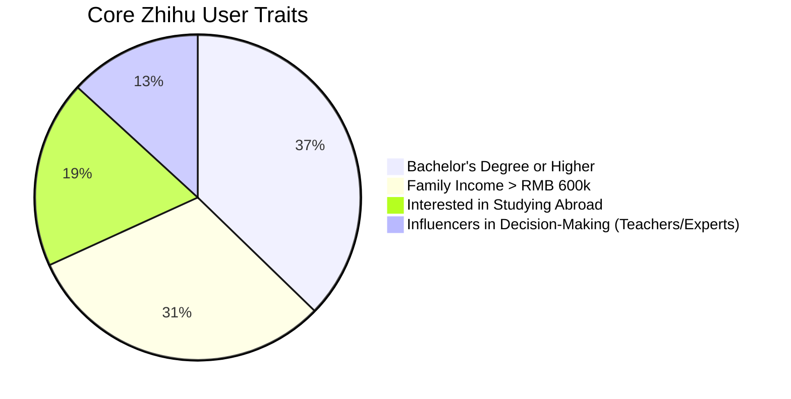

# Zhihu: A Must-Know Platform for NZ Educators Targeting China

## ⚡ When Kiwi Principals Meet Chinese Parents: A $370 Million Gap in Understanding

In a Zoom call at an Auckland high school, Principal James stared confused at his screen. For the fifth time this month, an email from Chinese parents had asked: "What's your official account on Zhihu?"

Behind this scenario are some eye-opening figures:

| Key Metrics                  | 2024 Data | Growth Rate |
| ---------------------------- | --------- | ----------- |
| Chinese students overseas    | 830,000   | 8.7%        |
| NZ market share              | NZD $370M | 4.2%        |
| Monthly views on Zhihu (Edu) | 210M      | 22%         |

## 🔍 Zhihu Unpacked: The Digital Lounge for High-Net-Worth Users

### User Persona: A Community Packed with Elites

Zhihu, with its 81 million monthly active users, is essentially a **mobile academic salon**. When Chinese parents type "NZ NCEA Curriculum" into Zhihu, they're not just seeking information—they're looking for credible, authoritative advice.

## 🥊 Platform Showdown: Zhihu's Competitive Advantage

We compared the effectiveness of three popular platforms for educational marketing:

| Dimension          | Zhihu                        | WeChat            | Douyin (TikTok)    |
| ------------------ | ---------------------------- | ----------------- | ------------------ |
| Content Depth      | ★★★★★ (5000+ words articles) | ★★★ (short posts) | ★★ (15-sec videos) |
| Trust Factor       | Verified experts + badges    | Personal networks | Influencer-driven  |
| Decision Influence | 78% (survey data)            | 43%               | 29%                |
| Long-tail Impact   | 3 years exposure             | 48-hour decay     | 72-hour cycle      |

The University of Hong Kong’s success story highlights this strategy. By answering 143 niche questions such as "HKU vs. Australia's Group of Eight," their Zhihu account became a **digital UCAS guide**, boosting conversions by 37%.

## 🛠️ Action Plan: Building a Zhihu Trust Flywheel in 3 Steps

### 1. Content Infrastructure: Build Knowledge Landmarks
- **Long-tail keyword coverage:** Create a keyword bank like "Auckland safety ratings" or "Waikato Uni CS ranking"
- **Verified expert profiles:** Principals become top "Edu topic contributors," admissions officers run "study abroad live Q&A"

### 2. Amplify Trust: Visual Authority
- **Data Dashboards:** Convert NZQA accreditation data into shareable infographics
- **Alumni Testimonials:** Invite graduates to regularly post columns on their NZ school experiences

### 3. Precision Engagement: AI + Localization
- Employ DeepL plus human reviews for **cultural localization**, turning Māori concepts into terms familiar to Chinese parents
- Develop an **AI chatbot**, available 24/7, addressing common queries like "NZ high school application timeline"

## 🌏 The Future Arena: VR Meets Knowledge Marketing

Otago University's experimental "Zhihu + Metaverse" project is pointing towards a new trend. Users explore virtual campuses, interacting in real-time with floating "knowledge capsules." This immersive approach has tripled conversion rates, showcasing the potential of combining **deep content with tech innovation**.

## 🔑 Key Takeaways: Win the Battle for Attention
1. Zhihu is the **dark pool of education decisions**—80% of study-abroad choices form here.
2. **Expert content is digital currency**; consistent publishing builds trust assets.
3. The battle in 2025 will hinge on **comprehensive knowledge mapping**, not merely advertising budgets.

While competitors are still sharing brochures on WeChat, savvy educators have built an **evergreen knowledge bank** on Zhihu. Winning this perception upgrade will belong to those NZ institutions who grasp the real value of **deep, lasting connections**.

> "In the flood of information, authority isn't a shouting match—it's trust compounded over time."
> — *2025 China Digital Education White Paper*

